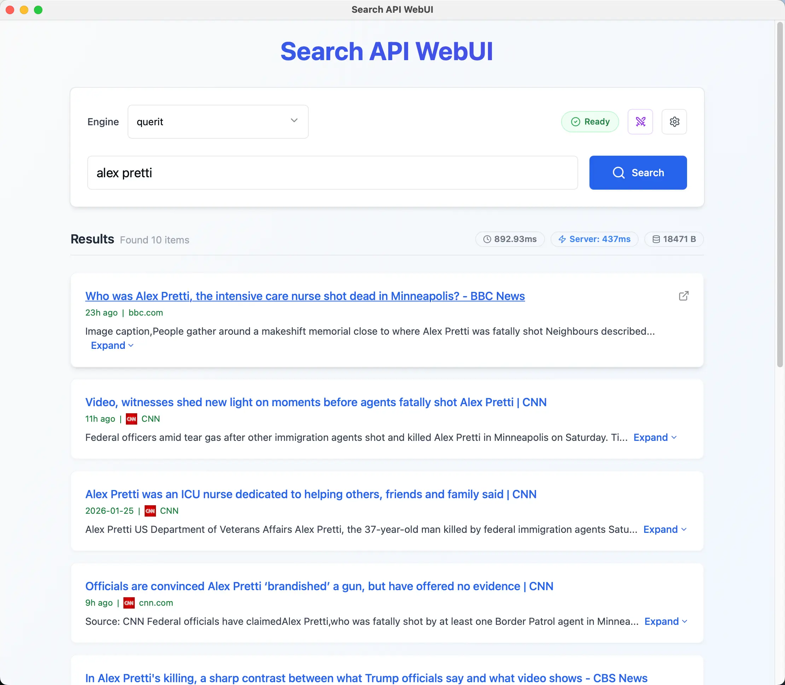

# Search API WebUI

Python WebUI with native Mac/Windows/Android Apps for testing, comparing, and visualizing Search APIs (Querit, You, Tavily, Exa, Baidu, Brave, Parallel etc.).



## Features

* **Search**: Support for multiple search api providers including:
  - [Querit.ai](https://www.querit.ai/en/docs/reference/post)
  - [You.com](https://docs.you.com/api-reference/search/v1-search)
  - [Tavily.com](https://docs.tavily.com/documentation/api-reference/introduction)
  - [Exa.ai](https://docs.exa.ai/reference/search)
  - [Parallel.ai](https://docs.parallel.ai/api-reference/search-beta/search)
  - [Baidu.com](https://cloud.baidu.com/doc/qianfan/s/2mh4su4uy)
  - [Brave.com](https://api-dashboard.search.brave.com/api-reference/web/search/get)
  - [Serper.dev](https://serper.dev)
  - You can add more generic Search APIs via configuration
* **SearchAPIWebUI Arena**: Compare two search providers side-by-side to benchmark latency, response size, and result relevance.
* **Performance Metrics**: Real-time display of request latency and response size.
* **Visual Rendering**: Renders standard search results (Title, URL, SiteName, SiteIcon, PageAge, Snippet) in a clean card layout.
* **Configurable**: Easy-to-edit `providers.yaml` to add or modify search providers.
* **Secure**: API Keys are stored locally in your $HOME folder.

## Installation

### macOS Installation

For macOS users, you can download the DMG installer from the GitHub Releases page:

1. Visit the [Releases page](https://github.com/querit-ai/search-api-webui/releases)
2. Download the appropriate DMG file for your Mac architecture:
   - **Apple Silicon (M1/M2/M3)**: `SearchAPIWebUI-<version>-macOS-arm64.dmg`
   - **Intel Macs**: `SearchAPIWebUI-<version>-macOS-x86_64.dmg`
3. Open the DMG file and drag `SearchAPIWebUI` to your Applications folder
4. Launch `SearchAPIWebUI` from Applications

**Note**: Since the application is not code-signed, macOS may block it on first launch. To allow it to run:
- Go to **System Settings** > **Privacy & Security**
- Look for the message about `SearchAPIWebUI` being blocked
- Click **Open Anyway** to allow the application to run

### Windows Installation

For Windows users, you can download the installer from the GitHub Releases page:

1. Visit the [Releases page](https://github.com/querit-ai/search-api-webui/releases)
2. Download the appropriate Setup file for your Windows system:
   - **64-bit Windows** (most common): `SearchAPIWebUI-<version>-Windows-x64-Setup.exe`
   - **32-bit Windows** (legacy): `SearchAPIWebUI-<version>-Windows-x86-Setup.exe`
3. Run the Setup executable and follow the installation wizard
4. Launch `SearchAPIWebUI` from the Start Menu or Desktop shortcut

**Note**:
- The installer requires .NET Framework 4.5 or later (usually pre-installed on Windows 8+)
- Windows Defender SmartScreen may show a warning for unsigned applications. Click "More info" → "Run anyway" to proceed

### Android Installation

For Android users, you can download the APK from the GitHub Releases page:

1. Visit the [Releases page](https://github.com/querit-ai/search-api-webui/releases)
2. Download the APK file: `SearchAPIWebUI-<version>-android-release.apk`
3. Enable "Install from unknown sources" in your device settings:
   - Go to **Settings** > **Security** > **Unknown sources**
   - Or on newer Android versions: **Settings** > **Apps** > **Special app access** > **Install unknown apps**
4. Open the downloaded APK file to install
5. Launch `SearchAPIWebUI` from your app drawer

**Requirements**:
- Android 5.0 (API 21) or later
- arm64-v8a architecture (covers 95%+ of modern Android devices)
- Internet permission (required for API calls)

**Note**: The app is signed with QUERIT PRIVATE LIMITED release certificate for security.

### Install via Pip

Use this method if you just want to run the tool without modifying the code.

```
pip install search-api-webui
```

### Run the Server

```
search-api-webui
```

## Development

Use this method if you want to contribute to the code or build from source.

### Prerequisites

* Python 3.8+
* Node.js & npm (for building the frontend)

### Quick Start with Makefile

**Clone the repository**

```bash
git clone https://github.com/querit-ai/search-api-webui.git
cd search-api-webui
```

**Development Mode** (with hot reload)

```bash
make dev
```

This will:
- Set up Python virtual environment and install dependencies
- Install frontend dependencies (node_modules)
- Start Flask backend on http://localhost:8889 with hot reload
- Start Vite frontend dev server on http://localhost:5173
- Automatically open your browser
- Enable hot module replacement for instant updates

**Build Python Wheel**

```bash
make              # or 'make all'
```

**Build macOS DMG** (macOS only)

```bash
make dmg          # Builds DMG for your current architecture (incl. .app build)
make build-app    # Build only the .app bundle (without DMG)
# Override architecture if needed:
make ARCH=arm64 dmg   # Force Apple Silicon build
make ARCH=x86_64 dmg  # Force Intel build (requires x86_64 Python)
```

**Build Android APK** (requires Docker or Linux with Buildozer)

```bash
make apk-debug     # Build debug APK
make apk-release   # Build release APK (requires keystore)
```

**Prerequisites for Android Build**:
- Linux environment or macOS with Docker
- Buildozer (`pip install buildozer`)
- Android SDK and NDK (automatically downloaded by Buildozer)
- For release builds: Android keystore file and signing credentials

The APK will be created in the `bin/` directory.

### Manual Setup

If you prefer not to use Makefile:

**Build Frontend**

```bash
cd frontend
npm install
npm run build
cd ..
```

**Install search-api-webui (Editable Mode)**

```bash
pip install -e .
```

**Run the Server**

```bash
python -m search_api_webui.app
```

### Available Make Commands

```bash
make              # Build Python wheel package (default)
make dev          # Start development servers with hot reload
make dmg          # Build macOS DMG for current architecture
make exe          # Build Windows installer for current architecture
make apk-debug    # Build Android debug APK
make apk-release  # Build Android release APK (requires keystore)
make clean        # Clean build artifacts
make clean-all    # Clean everything including virtual environment
make help         # Show all available commands
```

## Configuration

### Add API Keys

Open the WebUI settings page (click the gear icon). Enter your API Key for the selected provider (e.g., Querit). Keys are saved locally in $HOME/.search-api-webui/config.json.

### Add New Providers

Edit providers.yaml in the root directory to add custom API endpoints. The system uses JMESPath to map JSON responses to the UI.

```
my_custom_search:
  url: "https://api.example.com/search"
  method: "POST"
  headers:
    "Accept": "application/json"
    "Authorization": "Bearer {api_key}"
    "Content-Type": "application/json"
  payload:
    query: "{query}"
    count: "{limit}"
  response_mapping:
    root_path: "results.result"
    server_latency_path: "took"
    fields:
      url: "url"
      title: "title"
      site_name: "site_name"
      site_icon: "site_icon"
      page_age: "page_age"
```

## License

MIT License. See LICENSE for details.
